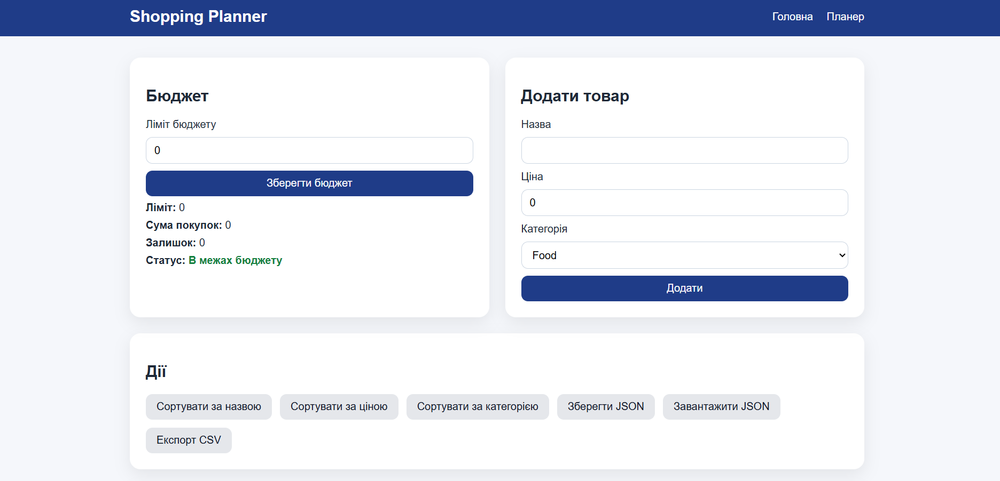

# Автор
Студентка групи ІПЗ-3/2
Стернійчук Дарина Олегівна

Проєкт для курсової роботи  
з дисципліни **Об'єктно-орієнтоване програмування**

Метою курсової роботи є розробка програмного застосунку для планування покупок із контролем бюджету та підтримкою категорій товарів. У процесі виконання роботи застосовано принципи об’єктно-орієнтованого програмування, спроєктовано структуру програми та реалізовано основні компоненти системи.

Під час розробки застосунку було реалізовано функції додавання та видалення товарів, сортування списку покупок, підрахунок загальної вартості товарів, перевірку перевищення бюджету, а також збереження даних у форматах JSON і CSV.

**У проєкті використано такі технології:**
C#
.NET 8
ASP.NET Core MVC
Razor Views
JSON
CSV
Git та GitHub
Unit Testing

**Опис проєкту**
Даний проєкт є вебзастосунком для планування покупок із можливістю контролю бюджету. Програма дозволяє користувачу створювати список товарів, розподіляти їх за категоріями та відстежувати загальну суму витрат. Основна ідея системи полягає в тому, щоб допомогти користувачу зручно організовувати покупки та контролювати витрати відносно встановленого бюджету.
Користувач може додавати нові товари до списку покупок, переглядати їх, видаляти непотрібні позиції та сортувати список за різними параметрами, такими як назва товару, ціна або категорія. Після кожної зміни списку автоматично перераховується загальна сума витрат і відображається залишок бюджету.
Також у програмі реалізовано можливість збереження списку покупок у форматі JSON та експорту даних у формат CSV. Це дозволяє зберігати результати роботи або відкривати список покупок у табличних редакторах.
Застосунок реалізовано мовою програмування C# з використанням фреймворку ASP.NET Core MVC, що забезпечує чітке розділення між моделями даних, логікою програми та інтерфейсом користувача.

**Патерни проєктування**
Під час розробки застосунку було використано декілька патернів проєктування.
Factory Method – використовується для створення об’єктів товарів різних типів.
Strategy – застосовується для реалізації різних способів сортування списку покупок.
Observer – використовується для відстеження змін у списку покупок і автоматичного оновлення бюджету.
Застосування цих патернів дозволило зробити структуру програми більш гнучкою, зрозумілою та зручною для подальшого розширення.
Структура проєкту

**Проєкт складається з кількох основних частин:**
Models – містять класи предметної області (товари, категорії, список покупок)
Controllers – відповідають за обробку запитів користувача
Services – реалізують бізнес-логіку програми
Strategy – реалізація стратегій сортування
Factory – фабрика створення об’єктів товарів
Views – інтерфейс користувача

Окремо у проєкті присутній модуль unit-тестів, який перевіряє правильність роботи основних компонентів системи.
**Вигляд сайту**
